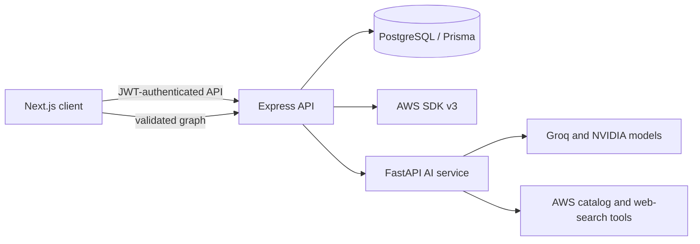

# CloudCanvas

CloudCanvas is a visual AWS infrastructure workspace for designing, validating,
and publishing connected cloud resources from a canvas. It gives developers a
clearer way to build small-to-medium AWS architectures without starting from a
blank SDK script or manually repeating the same console workflow.

The project turns an infrastructure sketch into an ordered deployment plan. It
validates resource compatibility, resolves dependencies, provisions through the
AWS SDK, and records desired configuration, deployed state, errors, and
deployment history. An AI assistant can explain AWS decisions or generate a
valid draft graph that the user reviews before publishing.

## The Problem

AWS infrastructure often spans several dependent resources. An EC2 instance
needs a key pair and security groups; a Lambda function needs an execution role;
a CloudFront distribution needs a ready S3 origin. Managing these relationships
across the AWS console, deployment scripts, and team documentation is error
prone and makes it difficult to see what is deployed and why.

CloudCanvas addresses this by making dependencies visible and enforceable. A
sketch is both the design surface and the source of truth for deployment. The
system blocks incompatible connections, deploys resources in graph order, polls
their state, and keeps resource details attached to the sketch.

## What It Does

- Authenticates users with credentials or Google, then persists their sketches,
  AWS connections, deployments, resources, and AI conversations.
- Lets users create, rename, import, and edit AWS infrastructure graphs with
  React Flow, including undo/redo and debounced autosave.
- Validates graph YAML/JSON in the shared client and server contract before it
  can become a deployable sketch.
- Deploys dependencies in sequence and waits for required source resources to
  be ready before creating their targets.
- Tracks deployed state, identifiers, IP addresses, URLs, DNS names, and
  failures through polling.
- Supports AI-assisted architecture help and graph generation. Generated graphs
  are validated against the same schema as manual graphs before they reach the
  canvas.
- Supports direct browser-to-S3 upload of files and folders through short-lived
  signed forms after a managed bucket is deployed.

## Implemented AWS Resources

| Area | Resources and relationships |
| --- | --- |
| Compute | EC2 instances, key pairs, security groups, IAM instance profiles |
| Containers | ECR repositories |
| Storage and delivery | S3 buckets and CloudFront distributions |
| Serverless | Lambda functions with IAM execution roles |
| Data and messaging | DynamoDB tables, SQS queues, SNS topics |
| Identity | IAM roles and managed policy attachments |

The graph permits only relationships that CloudCanvas can deploy safely:

```text
KEY_PAIR -----------\
                     -> EC2_INSTANCE
SECURITY_GROUP -----/

IAM_ROLE ------------> LAMBDA_FUNCTION

S3_BUCKET -----------> CLOUDFRONT_DISTRIBUTION
```

For static frontend delivery, CloudCanvas creates a private S3 REST origin,
CloudFront Origin Access Control, a distribution-scoped bucket policy, HTTPS
redirects, and managed security headers. The bucket is deployed and checked
before its connected distribution starts. See [CloudFront deployment notes](docs/cloudfront.md).

## Architecture



The `contracts` package is shared by the client and server. It defines the AWS
service union, graph schema, dependency rules, YAML parsing, configuration
references, and graph layout rules. This prevents the UI, API, and AI service
from accepting different graph shapes.

## Technology

| Layer | Technologies |
| --- | --- |
| Client | Next.js 16, React 19, TypeScript, Tailwind CSS, React Flow, NextAuth, Motion, Markdown-it, YAML |
| API | Node.js, Express 5, TypeScript, Prisma 7, PostgreSQL, JWT, bcrypt, Axios |
| AWS integration | AWS SDK for JavaScript v3 for EC2, ECR, IAM, S3, CloudFront, Lambda, DynamoDB, SQS, and SNS |
| Graph contract | TypeScript, AJV JSON Schema validation, YAML parsing |
| AI service | Python, FastAPI, Pydantic, LangChain, LangGraph, ChatGroq, ChatNVIDIA |
| Persistence and operations | Encrypted AWS credential storage, deployment/resource records, polling, in-memory catalog caching, structured server logs |

## Security Model

AWS credentials are stored encrypted by the server and are never sent to the
client. A user can only access their own sketches, connections, conversations,
and resources. S3 browser uploads use scoped, short-lived signed POST forms
instead of routing file data through the API. CloudFront uses an Origin Access
Control and a distribution-scoped S3 bucket policy so a managed frontend bucket
can remain private.

The AWS connection must have permission for the selected resources. CloudCanvas
does not create unrestricted IAM credentials or bypass AWS account-level
policies, service quotas, or regional availability.

## Local Development

Prerequisites: Node.js, npm, PostgreSQL, Python 3.12+, and Conda. The project
uses the `cloudcanvas-venv` Conda environment for the AI service.

1. Start PostgreSQL and create a database named `cloudcanvas`.
2. Copy and complete the environment files:

   ```bash
   cp server/.env.example server/.env
   cp client/.env.example client/.env.local
   cp service/.env.example service/.env
   ```

3. Install dependencies and prepare the database:

   ```bash
   cd contracts && npm install && npm run build
   cd ../server && npm install && npm run db:generate && npm run db:push
   cd ../client && npm install
   cd ../service && conda run -n cloudcanvas-venv pip install -r requirements.txt
   ```

4. Run the three services in separate terminals:

   ```bash
   cd server && npm run dev
   cd client && npm run dev
   cd service && conda run -n cloudcanvas-venv uvicorn app:app --reload --port 8000
   ```

The default endpoints are the client at `http://localhost:3000`, API at
`http://localhost:9000`, and AI service at `http://localhost:8000`.

## Validation

```bash
cd contracts && npm test
cd server && npm test
cd client && npm run lint && npm run build -- --webpack
conda run -n cloudcanvas-venv python -m unittest discover -s service/tests
```

These checks verify contracts, deployment behavior with mocked AWS SDK calls,
client types and build output, and the AI schema. They do not prove deployment
against a live AWS account or delivery through a live CloudFront distribution.

## Current Scope

CloudCanvas currently focuses on AWS resource design and deployment. GitHub
repository integration, Docker image workflows, custom domains, CDN logging,
and full infrastructure-as-code export are future work, not current features.
